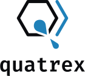

  <picture>
    <source media="(prefers-color-scheme: dark)" srcset="./docs/images/logo_text_dark.svg">
    <source media="(prefers-color-scheme: light)" srcset="./docs/images/logo_text_light.svg">
    
  </picture>
    

---

The `quatrex` package is an _ab initio_ quantum transport simulator
developed at ETH Zürich. Starting from a description of a nanosystem's
geometry, its electronic structure, and a set of relevant configuration
parameters, `quatrex` computes transport properties, such as
transmission and current spectra, non-equilibrium charge carrier
densities, and current-voltage characteristics. It is built from the
ground up for distributed-memory supercomputers and scales to some of
the largest systems in the world.

## Key features

<!-- TODO: Bullet points with descriptions -->

## Requirements

- Python 3.x <!-- TODO: specify exact supported versions -->
- NumPy
- Numba
- mpi4py
- CuPy (optional, required for GPU execution)

## Installation

<!-- TODO -->

## Documentation

More comprehensive user documentation is available at:

[quatrex.github.io/quatrex](https://quatrex.github.io/quatrex/)

## Contributing

Contributions are welcome. Please see
[contributing.md](docs/contributing.md) for guidelines, and use the
[issue tracker](https://github.com/quatrex/quatrex/issues) for bug
reports and feature requests.

## License

This project is licensed under the [BSD 3-Clause License](LICENSE).

## Acknowledgments

<!-- TODO -->
